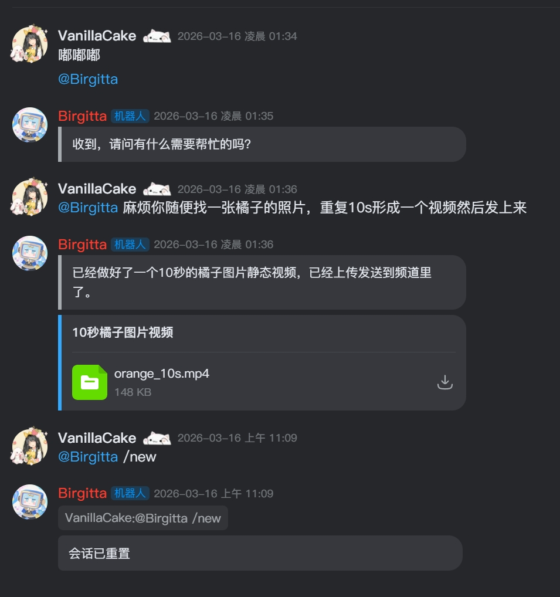
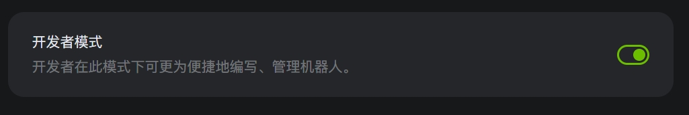
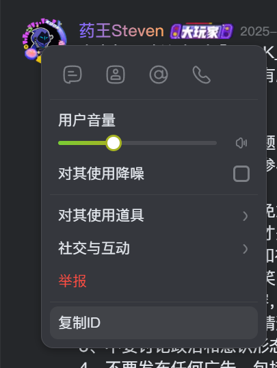

# @kookapp/openclaw-kook

<p>
  
  
</p>

KOOK 平台的 OpenClaw 通道插件。



## 安装

由于 OpenClaw 的插件系统在其 `2026.3.23` 版本附近发生大改，对应的 KOOK 插件也做了版本区分，务必注意。

### 对于 OpenClaw 版本 >= `2026.3.23` 的用户

放心使用 `@latest` 版本即可。

```bash
openclaw plugins install @kookapp/openclaw-kook@latest
```

### 对于 OpenClaw 版本 < `2026.3.23` 的用户

请使用 `1.0.5` 版本，后续可能不再针对旧版 OpenClaw 进行维护。

```bash
openclaw plugins install @kookapp/openclaw-kook@1.0.5
```

### 如何查看 OpenClaw 版本

```bash
openclaw --version
# 将看到：OpenClaw 2026.3.23-2 (7ffe7e4)
```

### beta 版

可前往 [npm 包页面](https://www.npmjs.com/package/@kookapp/openclaw-kook?activeTab=versions) 查看可用的 beta 版本。beta 版本更新更快、含有更多特性，但是稳定性差，只推荐开发者尝鲜。

## 更新与卸载

### 更新

```bash
openclaw plugins update openclaw-kook
```

### 卸载

1. 执行 `openclaw plugins uninstall openclaw-kook`，短暂等待后按 `y` 回车确认卸载
2. 删除 `~/.openclaw/extensions/openclaw-kook` 目录
3. 请 AI 帮你：“参考 OpenClaw Config Schema，编辑 ~/.openclaw/openclaw.json，删除 `openclaw-kook` 相关的配置”

## 配置

### 1. 获取 KOOK Bot Token

访问 [KOOK 开发者平台](https://developer.kookapp.cn/bot/) 创建机器人，并在机器人配置页获取 Bot Token。

### 2. 通过 Web 界面配置（推荐）

打开配置页面：

```bash
openclaw dashboard
```

在设置中找到 KOOK 通道并填写配置。字段的完整说明见下方“配置项说明”。

### 3. 如何查看 User ID

1. 进入 KOOK - 个人设置 - 高级设置，打开开发者模式。

   

2. 在服务器中右键一位用户的头像，选择复制 ID。

   

### 4. （可选）使用命令行配置

```bash
openclaw config set channels.kook.enabled true
openclaw config set channels.kook.botAuth "你的Bot Token"
openclaw config set channels.kook.dmPolicy allowlist
openclaw config set channels.kook.allowFrom '["你的用户ID"]'
```

### 5. 重启服务

```bash
openclaw gateway restart
```

## 配置示例

### 最小可用配置

```yaml
channels:
  kook:
    enabled: true
    botAuth: '你的Bot Token'
```

### 推荐配置

```yaml
channels:
  kook:
    enabled: true
    botAuth: '你的Bot Token'
    dmPolicy: allowlist
    allowFrom:
      - '1234567890'
    acceptBotMessage: true
```

### 群组 mention 配置

默认情况下，群组内需要 `@机器人` 才会触发对话。你可以通过 `channels.kook.groups[groupId].requireMention` 为指定频道单独配置，也可以用 `channels.kook.groups["*"].requireMention` 作为默认值。

```yaml
channels:
  kook:
    groups:
      '*':
        requireMention: true
      '1234567890123456':
        requireMention: false
```

### 实验特性配置

`trustedGuilds` 仅在环境变量 `ENABLE_EXPERIMENTAL_FEATURES=1` 时生效；未开启时该配置会被视为 `[]`。

```bash
ENABLE_EXPERIMENTAL_FEATURES=1
```

```yaml
channels:
  kook:
    enabled: true
    botAuth: '你的Bot Token'
    trustedGuilds:
      - 'guild_id_1'
      - 'guild_id_2'
```

## 配置项说明

| 字段               | 类型                                       | 默认值                   | 说明                                                  |
| ------------------ | ------------------------------------------ | ------------------------ | ----------------------------------------------------- |
| `enabled`          | `boolean`                                  | `true`                   | KOOK 频道总的使能开关                                 |
| `botAuth`          | `string`                                   | `""`                     | KOOK Bot Token，推荐使用的外部配置字段                |
| `baseUrl`          | `string`                                   | `https://www.kookapp.cn` | KOOK API 地址                                         |
| `dmPolicy`         | `pairing \| allowlist \| open \| disabled` | `open`                   | 私信访问策略                                          |
| `allowFrom`        | `string[]`                                 | `[]`                     | 允许访问的用户 ID 列表，填写原始 userId 或 `*`        |
| `acceptBotMessage` | `boolean`                                  | `true`                   | 是否接收其他机器人的消息并加入上下文                  |
| `trustedGuilds`    | `string[]`                                 | `[]`                     | 实验特性；这些服务器中的成员会自动视为 allowlist 用户 |

## 行为说明

- 私信场景**无需 mention** 即可触发对话。
- 群组场景默认**需要 @机器人** 才会触发对话，可通过 `channels.kook.groups[groupId].requireMention` 覆盖。
- 当 `dmPolicy=allowlist` 时，只有 `allowFrom` 中的用户可以通过私信访问。
- 当 `dmPolicy=pairing` 时，会结合 OpenClaw 的配对/授权存储进行访问控制。
- 当 `dmPolicy=disabled` 时，私信访问会被拒绝。

## 常见问题

### 为什么安装过程中，报错缺少依赖？

本频道插件自身的依赖清晰简单，管理一切正常。如有看到类似于 `ajv` 等依赖包报错，是 OpenClaw 的依赖管理出了问题。除了向 OpenClaw 官方提交 Issue 以外，以下是一个临时解决方案，以确保您本机能跑：

1. 观察报错，找到具体缺哪些依赖

   ```bash
   Error: xxx not found
   ```

2. 进入插件目录，直接补充缺少项

   ```bash
   cd ~/.openclaw/extensions/openclaw-kook
   npm install xxx
   ```

3. 以下是已知 OpenClaw 遗漏的依赖，我们已在自己的包中主动添加：

- `ajv`

## License

尚未确定，暂无许可证。
